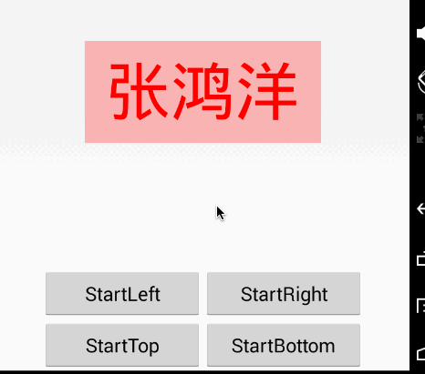
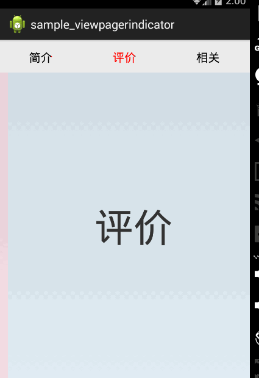

# Android-ColorTrackView
字体或者图片可以逐渐染色和逐渐褪色的动画效果

# 使用

```xml
 <com.zhy.view.ColorTrackView
        android:id="@+id/id_changeTextColorView"
        android:layout_width="wrap_content"
        android:layout_height="wrap_content"
        android:layout_centerInParent="true"
        android:layout_centerVertical="true"
        android:padding="20dp"
        android:background="#44ff0000"
        android:gravity="center_vertical"
        zhy:progress="0"
        zhy:direction="left"
        zhy:text="张鸿洋"
        zhy:text_change_color="#ffff0000"
        zhy:text_origin_color="#ff000000"
        zhy:text_size="60sp" />
```

注：zhy为命名空间，xmlns:zhy="http://schemas.android.com/apk/res-auto"，可自由修改。

* `progress`  [0.0f , 1.0f]
* `text` 绘制的文本
* `text_change_color`目标颜色
* `text_origin_color`原始颜色
* `text_size`字体大小
* `direction `方向，枚举类型，支持：left,right,top,bottom

# 效果图

## 简单使用


## 结合ViewPager



# 关于我
[我的博客地址](http://blog.csdn.net/lmj623565791)


